# Hệ thống Database — PostgreSQL (ich-app)

> Tài liệu tham chiếu schema DB của **ich-app** (RBAC + quản lý kho + nhà cung cấp + item master/BOM cho sản xuất mỹ phẩm).
> **Nguồn sự thật**: `migrations/00{1..5}_*.sql` + `data/*.csv`. Tài liệu này mô tả **tầng database**; nghiệp vụ tầng ứng dụng (per-type item authz, cycle BOM, immutable cột…) xem [`CLAUDE.md`](../CLAUDE.md).
> Cập nhật: 2026-06-11.

## Mục lục

1. [Tổng quan](#1-tổng-quan)
2. [Sơ đồ quan hệ (ERD)](#2-sơ-đồ-quan-hệ-erd)
3. [Quy ước chung](#3-quy-ước-chung)
4. [Chi tiết bảng theo domain](#4-chi-tiết-bảng-theo-domain)
5. [Danh mục Enum (CHECK)](#5-danh-mục-enum-check)
6. [Danh mục khoá ngoại (Foreign Key)](#6-danh-mục-khoá-ngoại-foreign-key)
7. [Seed & nạp migration](#7-seed--nạp-migration)

---

## 1. Tổng quan

- **DBMS**: PostgreSQL 18 (DB tên `pgdb`, user `admin` — chạy qua `docker-compose.dev.yaml`).
- **Extension**: `pgcrypto` (001), `pg_partman` (003, schema `partman`).
- **Khoá chính**: mọi bảng dùng `UUID DEFAULT uuidv7()` (hàm native PG18) — UUID **sortable theo thời gian tạo**.
- **Cấu hình DB** (áp ở `001_init.sql`): `datestyle = 'ISO, DMY'`, `timezone = 'Asia/Ho_Chi_Minh'`.
- **Tổng cộng 19 bảng** chia 5 nhóm domain:

| Nhóm | Bảng |
|---|---|
| **A. Auth & RBAC** (9) | `users`, `user_sessions`, `roles`, `permissions`, `role_permissions`, `user_roles`, `password_tokens`, `files`, `user_avatars` |
| **B. Warehouse** (3) | `locations`, `warehouse_zones`, `storage_bins` |
| **C. Vendor** (2) | `vendors`, `vendor_items` |
| **D. Item Master & BOM** (4) | `items`, `item_uom_conversions`, `boms`, `bom_lines` |
| **E. Audit** (1) | `audit_logs` (partitioned) |

- **Thứ tự nạp migration** (qua `docker-entrypoint-initdb.d`, **chỉ chạy khi volume mới**, theo alphabet): `001_init` (schema) → `002_trigger` (updated_at + audit) → `003_partition` (pg_partman) → `004_test` (toàn bộ comment) → `005_seed` (COPY từ CSV).

---

## 2. Sơ đồ quan hệ (ERD)

```mermaid
erDiagram
    users ||--o{ user_sessions : "phiên"
    users ||--o{ password_tokens : "token"
    users ||--o{ user_roles : ""
    roles ||--o{ user_roles : ""
    roles ||--o{ role_permissions : ""
    permissions ||--o{ role_permissions : ""
    users ||--o{ user_avatars : ""
    files ||--o{ user_avatars : ""
    locations ||--o{ warehouse_zones : "khu vực"
    warehouse_zones ||--o{ storage_bins : "kệ"
    vendors ||--o{ vendor_items : ""
    items ||--o{ vendor_items : ""
    items ||--o{ item_uom_conversions : "đơn vị"
    items ||--o{ boms : "output"
    boms ||--o{ bom_lines : "dòng"
    items ||--o{ bom_lines : "component"

    users {
        uuid id PK
        varchar email
        varchar status
        timestamptz deleted_at
    }
    user_sessions {
        uuid id PK
        uuid user_id FK
        char token_hash
        timestamptz revoked_at
    }
    roles {
        uuid id PK
        varchar name
        varchar status
    }
    permissions {
        uuid id PK
        varchar code
    }
    role_permissions {
        uuid role_id FK
        uuid permission_id FK
    }
    user_roles {
        uuid user_id FK
        uuid role_id FK
    }
    password_tokens {
        uuid id PK
        uuid user_id FK
        varchar type
    }
    files {
        uuid id PK
        text path
    }
    user_avatars {
        uuid file_id FK
        uuid user_id FK
        bool is_primary
    }
    locations {
        uuid id PK
        varchar code
        varchar name
    }
    warehouse_zones {
        uuid id PK
        uuid location_id FK
        varchar zone_type
    }
    storage_bins {
        uuid id PK
        uuid zone_id FK
        varchar code
    }
    vendors {
        uuid id PK
        varchar code
        varchar vendor_type
    }
    vendor_items {
        uuid id PK
        uuid vendor_id FK
        uuid item_id FK
    }
    items {
        uuid id PK
        varchar sku
        varchar type
        varchar base_uom
    }
    item_uom_conversions {
        uuid id PK
        uuid item_id FK
        varchar alternative_uom
    }
    boms {
        uuid id PK
        uuid output_item_id FK
        varchar bom_type
        varchar status
    }
    bom_lines {
        uuid id PK
        uuid bom_id FK
        uuid component_item_id FK
    }
    audit_logs {
        uuid id PK
        timestamptz changed_at PK
        varchar table_name
        varchar action
    }
```

> `items` là **tâm** của domain sản xuất: được trỏ tới bởi `vendor_items`, `item_uom_conversions`, `boms.output_item_id` và `bom_lines.component_item_id`. Quan hệ BOM đa cấp (`boms` → `bom_lines` → `items` component → BOM khác) tạo cây nguyên vật liệu; chống chu trình (cycle) enforce ở tầng app.

---

## 3. Quy ước chung

### 3.1. Khoá chính & thời gian

- **PK**: `id UUID NOT NULL DEFAULT uuidv7()` (ngoại lệ: bảng junction `role_permissions`/`user_roles`/`user_avatars` dùng PK composite; `audit_logs` PK composite `(id, changed_at)`).
- **Thời gian**: `created_at` / `updated_at TIMESTAMPTZ(3) NOT NULL DEFAULT NOW()` (độ chính xác mili-giây).
- **Trigger `set_updated_at`** (`002_trigger.sql`): tự cập nhật `updated_at := NOW()` mỗi `UPDATE` (chỉ khi `NEW IS DISTINCT FROM OLD`). Một **DO-block quét động** `information_schema.columns` gắn trigger `trg_updated_at_<table>` cho **MỌI bảng có cột `updated_at`** — không cần đăng ký tay (bảng `permissions`, `password_tokens`, `user_avatars`, `audit_logs` **không** có `updated_at` ⇒ không gắn).

### 3.2. Soft-delete (xoá mềm)

- Cột `deleted_at TIMESTAMPTZ(3)` (NULL = còn sống). **Xoá = `UPDATE … SET deleted_at = NOW()`**, không `DELETE` vật lý.
- Đi kèm **partial unique index** `… WHERE deleted_at IS NULL` → cho phép **tái dùng** `code`/`sku`/`email`/`name` sau khi xoá mềm.
- **12 bảng áp dụng**: `users`, `roles`, `files`, `user_avatars`, `locations`, `warehouse_zones`, `storage_bins`, `vendors`, `items`, `item_uom_conversions`, `boms`, `bom_lines`.
- ⚠️ Vì soft-delete là `UPDATE`, FK `ON DELETE RESTRICT` **không** tự kích hoạt khi xoá cha còn con → việc "chặn xoá khi còn con" kiểm ở **tầng app** (`EXISTS … WHERE deleted_at IS NULL`).
- Ngoại lệ: `user_sessions` không có `deleted_at` (dùng `revoked_at`); `permissions`/`role_permissions`/`user_roles`/`vendor_items`/`audit_logs` không xoá mềm.

### 3.3. Audit log tự động

- Hàm `fn_generic_audit_log()` (`002_trigger.sql`) + DO-block thứ 2 gắn **2 trigger cho mọi bảng** (trừ `audit_logs%`):
  - `trg_audit_ins_del_<table>` — `AFTER INSERT OR DELETE`.
  - `trg_audit_upd_<table>` — `AFTER UPDATE` kèm `WHEN (OLD.* IS DISTINCT FROM NEW.*)` (bỏ qua update không đổi).
- **Ngữ cảnh** lấy từ session GUC: `ich_app.current_transaction_id` (batch id; sinh `uuidv7()` nếu thiếu) và `ich_app.current_user_id` (mặc định `'SYSTEM'`). App `SET` 2 biến này đầu mỗi request để gắn người thao tác.
- **Nội dung ghi vào `audit_logs`**: `UPDATE` chỉ lưu **các cột thực sự đổi** (diff JSONB `o.value IS DISTINCT FROM n.value`); `INSERT` lưu full `new_data`; `DELETE` lưu full `old_data`. `record_id` = các cột PK nối bằng `:`.

### 3.4. Partition `audit_logs`

- `audit_logs` khai báo `PARTITION BY RANGE (changed_at)`, PK composite `(id, changed_at)` (bắt buộc gồm cột phân vùng).
- `003_partition.sql` gọi `partman.create_parent('public.audit_logs', p_control := 'changed_at', p_interval := '1 day', p_premake := 3)` → partition **theo ngày**, tạo sẵn 3 phân vùng tương lai; pg_partman background worker tự tạo tiếp.

### 3.5. Kiểu số & Enum

- **Số đo dùng `DOUBLE PRECISION`** (khớp `f64` toàn app, sqlx **chưa bật** feature decimal): `items.density_g_ml`, `boms.output_qty`, `bom_lines.{quantity, input_qty, scrap_pct}` và cột zone `warehouse_zones.{temp_min_c, temp_max_c, humidity_max_pct}`.
- **Ngoại lệ DECIMAL** duy nhất: `item_uom_conversions.conversion_factor DECIMAL(15,6)` (hệ số quy đổi đơn vị, cần chính xác).
- **Enum = `VARCHAR` + `CHECK (… IN (...))`** (KHÔNG dùng native `ENUM` type). Một số cột "enum theo comment" **không** có CHECK (enforce ở app) — xem [mục 5](#5-danh-mục-enum-check).

---

## 4. Chi tiết bảng theo domain

> Quy ước cột **Null**: «Có» = cho phép `NULL`; «Không» = `NOT NULL`.

### A. Auth & RBAC

#### `users` — người dùng

| Cột | Kiểu | Null | Mặc định | Ghi chú |
|---|---|---|---|---|
| id | UUID | Không | uuidv7() | PK |
| email | VARCHAR(255) | Không | — | unique (partial) |
| password_hash | TEXT | Có | — | argon2; NULL khi `PENDING_PASSWORD` |
| username | VARCHAR(100) | Có | — | |
| status | VARCHAR(20) | Không | 'PENDING_PASSWORD' | `ACTIVE` \| `DEACTIVATED` \| `PENDING_PASSWORD` (app) |
| deactivated_at | TIMESTAMPTZ(3) | Có | — | vô hiệu hoá lúc nào |
| deleted_at | TIMESTAMPTZ(3) | Có | — | soft-delete |
| password_changed_at | TIMESTAMPTZ(3) | Có | — | lần cuối đổi mật khẩu |
| created_at | TIMESTAMPTZ(3) | Không | NOW() | |
| updated_at | TIMESTAMPTZ(3) | Không | NOW() | |

- **PK** `pk_users(id)`.
- **CHECK** `chk_users_pending_password`: `status = 'PENDING_PASSWORD' OR username IS NOT NULL OR password_hash IS NOT NULL`.
- **Index**: `idx_users_email_unique` UNIQUE`(email) WHERE deleted_at IS NULL`; `idx_users_status(status) WHERE deleted_at IS NULL`.
- Được trỏ tới bởi: `user_sessions`, `password_tokens`, `user_roles`, `user_avatars`.

#### `user_sessions` — phiên đăng nhập

| Cột | Kiểu | Null | Mặc định | Ghi chú |
|---|---|---|---|---|
| id | UUID | Không | uuidv7() | PK |
| user_id | UUID | Không | — | FK → `users` (CASCADE) |
| token_hash | CHAR(64) | Không | — | UNIQUE; sha256(raw token) |
| device_id | VARCHAR(255) | Có | — | fingerprint client |
| device_name | VARCHAR(255) | Có | — | vd "Chrome 124 · Windows 11" |
| device_type | VARCHAR(20) | Không | — | `web` \| `desktop` \| `mobile` (app) |
| platform | VARCHAR(100) | Có | — | vd "Windows 11" |
| app_version | VARCHAR(50) | Có | — | chỉ desktop app |
| user_agent | TEXT | Có | — | raw header |
| ip_address | INET | Có | — | IP lúc login |
| revoked_at | TIMESTAMPTZ(3) | Có | — | thu hồi lúc nào |
| revoke_reason | VARCHAR(20) | Có | — | `LOGOUT`\|`FORCED`\|`USER`\|`EXPIRED` (CHECK) |
| expires_at | TIMESTAMPTZ(3) | Không | — | hết hạn |
| created_at | TIMESTAMPTZ(3) | Không | NOW() | |
| updated_at | TIMESTAMPTZ(3) | Không | NOW() | |

- **PK** `pk_user_sessions(id)`. **CHECK** `chk_revoke_reason`.
- **Index**: `uq_idx_token_hash` UNIQUE`(token_hash)`; `idx_refresh_user(user_id)`; `idx_user_revoked(user_id, revoked_at)`.
- **FK** `fk_user_sessions_user_id` → `users(id)` `ON DELETE CASCADE`. Không soft-delete (dùng `revoked_at`).

#### `roles` — vai trò

| Cột | Kiểu | Null | Mặc định | Ghi chú |
|---|---|---|---|---|
| id | UUID | Không | uuidv7() | PK |
| name | VARCHAR(255) | Không | — | |
| description | TEXT | Không | '' | |
| status | VARCHAR(20) | Không | 'ACTIVE' | `ACTIVE` \| `DEACTIVATED` (app) |
| deactivated_at | TIMESTAMPTZ(3) | Có | — | |
| deleted_at | TIMESTAMPTZ(3) | Có | — | soft-delete |
| can_delete | BOOLEAN | Không | TRUE | chặn xoá role hệ thống (app) |
| can_update | BOOLEAN | Không | TRUE | chặn sửa role hệ thống (app) |
| created_at | TIMESTAMPTZ(3) | Không | NOW() | |
| updated_at | TIMESTAMPTZ(3) | Không | NOW() | |

- **PK** `pk_roles(id)`.
- **Index**: `idx_roles_status(status) WHERE deleted_at IS NULL`; `idx_roles_name_status_active(name, status) WHERE deleted_at IS NULL`.
- Super-admin role id `019c0cd2-374b-795a-a028-460024d912b7` (seed).

#### `permissions` — quyền

| Cột | Kiểu | Null | Mặc định | Ghi chú |
|---|---|---|---|---|
| id | UUID | Không | uuidv7() | PK |
| code | VARCHAR(100) | Không | — | UNIQUE; dạng `RESOURCE_ACTION` |
| description | TEXT | Không | '' | |
| created_at | TIMESTAMPTZ(3) | Không | NOW() | |

- **PK** `pk_permissions(id)`. **UNIQUE** `permissions_code_unique(code)`.
- Không `updated_at` (không gắn trigger updated_at), không soft-delete. **Nguồn sự thật** = [`data/permissions.csv`](../data/permissions.csv).

#### `role_permissions` — gán quyền cho vai trò (junction M:N)

| Cột | Kiểu | Null | Mặc định | Ghi chú |
|---|---|---|---|---|
| role_id | UUID | Không | — | FK → `roles` |
| permission_id | UUID | Không | — | FK → `permissions` |
| created_at | TIMESTAMPTZ(3) | Không | NOW() | |

- **PK** `pk_role_permissions(role_id, permission_id)`.
- **FK**: `fk_role_permissions_role_id` → `roles(id)` `RESTRICT / ON UPDATE CASCADE`; `fk_role_permissions_permission_id` → `permissions(id)` `RESTRICT / ON UPDATE CASCADE`.

#### `user_roles` — gán vai trò cho người dùng (junction M:N)

| Cột | Kiểu | Null | Mặc định | Ghi chú |
|---|---|---|---|---|
| user_id | UUID | Không | — | FK → `users` |
| role_id | UUID | Không | — | FK → `roles` |
| created_at | TIMESTAMPTZ(3) | Không | NOW() | |

- **PK** `pk_user_roles(user_id, role_id)`.
- **FK**: `fk_user_roles_user_id` → `users(id)` `RESTRICT / ON UPDATE CASCADE`; `fk_user_roles_role_id` → `roles(id)` `RESTRICT / ON UPDATE CASCADE`.

#### `password_tokens` — token đặt/đổi mật khẩu

| Cột | Kiểu | Null | Mặc định | Ghi chú |
|---|---|---|---|---|
| id | UUID | Không | uuidv7() | PK |
| user_id | UUID | Không | — | FK → `users` (CASCADE) |
| token_hash | TEXT | Không | — | UNIQUE |
| type | VARCHAR(20) | Không | — | `INIT` \| `RESET-PASSWORD` (CHECK) |
| expires_at | TIMESTAMPTZ(3) | Không | — | |
| used_at | TIMESTAMPTZ(3) | Có | — | đã dùng lúc nào |
| created_at | TIMESTAMPTZ(3) | Không | NOW() | |

- **PK** `pk_password_tokens(id)`. **UNIQUE** `uq_password_tokens_token_hash(token_hash)`. **CHECK** `chk_password_tokens_type`.
- **Index**: `idx_password_tokens_user_id(user_id)`; `idx_password_tokens_expires_at(expires_at)`.
- **FK** `fk_password_tokens_user_id` → `users(id)` `ON DELETE CASCADE`. Không `updated_at`.

#### `files` — danh mục file

| Cột | Kiểu | Null | Mặc định | Ghi chú |
|---|---|---|---|---|
| id | UUID | Không | uuidv7() | PK |
| original_name | TEXT | Không | — | tên gốc khi upload |
| mime_type | VARCHAR(100) | Không | — | |
| destination | TEXT | Không | — | đường dẫn ngắn |
| file_name | TEXT | Không | — | |
| path | TEXT | Không | — | đường dẫn đầy đủ; unique (partial) |
| size | BIGINT | Không | — | bytes |
| uploaded_by | UUID | Không | — | id người upload (**không** có FK cứng) |
| deleted_at | TIMESTAMPTZ(3) | Có | — | soft-delete |
| created_at | TIMESTAMPTZ(3) | Không | NOW() | |
| updated_at | TIMESTAMPTZ(3) | Không | NOW() | |

- **PK** `pk_files(id)`.
- **Index**: `uix_files_path` UNIQUE`(path) WHERE deleted_at IS NULL`; `idx_files_deleted_at(deleted_at) WHERE deleted_at IS NULL`.

#### `user_avatars` — ảnh đại diện (junction file ↔ user)

| Cột | Kiểu | Null | Mặc định | Ghi chú |
|---|---|---|---|---|
| file_id | UUID | Không | — | FK → `files` (CASCADE) |
| user_id | UUID | Không | — | FK → `users` (RESTRICT) |
| width | INTEGER | Không | — | px |
| height | INTEGER | Không | — | px |
| is_primary | BOOLEAN | Không | FALSE | ảnh chính |
| deleted_at | TIMESTAMPTZ(3) | Có | — | soft-delete |
| created_at | TIMESTAMPTZ(3) | Không | NOW() | |

- **PK** `pk_user_avatars(file_id, user_id)`.
- **Index**: `idx_user_avatars_selected(is_primary) WHERE is_primary IS TRUE`.
- **FK**: `fk_user_avatars_user_id` → `users(id)` `RESTRICT / ON UPDATE CASCADE`; `fk_user_avatars_file_id` → `files(id)` `CASCADE / ON UPDATE CASCADE`. Không `updated_at`.

### B. Warehouse

#### `locations` — vị trí kho (toà nhà/chi nhánh)

| Cột | Kiểu | Null | Mặc định | Ghi chú |
|---|---|---|---|---|
| id | UUID | Không | uuidv7() | PK |
| code | VARCHAR(50) | Không | — | unique (partial) |
| name | VARCHAR(150) | Không | — | |
| address | VARCHAR(255) | Có | — | |
| deleted_at | TIMESTAMPTZ(3) | Có | — | soft-delete |
| created_at | TIMESTAMPTZ(3) | Không | NOW() | |
| updated_at | TIMESTAMPTZ(3) | Không | NOW() | |

- **PK** `pk_locations(id)`. **Index**: `uq_locations_code` UNIQUE`(code) WHERE deleted_at IS NULL`.

#### `warehouse_zones` — khu vực trong kho

| Cột | Kiểu | Null | Mặc định | Ghi chú |
|---|---|---|---|---|
| id | UUID | Không | uuidv7() | PK |
| location_id | UUID | Không | — | FK → `locations` (RESTRICT) |
| name | VARCHAR(150) | Không | — | |
| zone_type | VARCHAR(50) | Không | — | 7 giá trị (CHECK) |
| temp_min_c | DOUBLE PRECISION | Có | — | nhiệt độ min (°C) |
| temp_max_c | DOUBLE PRECISION | Có | — | nhiệt độ max (°C) |
| humidity_max_pct | DOUBLE PRECISION | Có | — | độ ẩm max (%) |
| is_light_protected | BOOLEAN | Không | FALSE | tránh sáng |
| is_ventilated | BOOLEAN | Không | FALSE | thông gió |
| is_explosion_proof | BOOLEAN | Không | FALSE | chống cháy nổ |
| deleted_at | TIMESTAMPTZ(3) | Có | — | soft-delete |
| created_at | TIMESTAMPTZ(3) | Không | NOW() | |
| updated_at | TIMESTAMPTZ(3) | Không | NOW() | |

- **PK** `pk_warehouse_zones(id)`.
- **CHECK**: `chk_warehouse_zones_type` (`zone_type IN ('FINISHED_GOODS','RAW_MATERIAL','PACKAGING','QUARANTINE','REJECT','RETURN','UTILITY')`); `chk_warehouse_zones_temp_range` (`temp_min_c IS NULL OR temp_max_c IS NULL OR temp_min_c <= temp_max_c`); `chk_warehouse_zones_humidity` (`humidity_max_pct IS NULL OR (humidity_max_pct >= 0 AND humidity_max_pct <= 100)`).
- **Index**: `uq_warehouse_zones_loc_name` UNIQUE`(location_id, name) WHERE deleted_at IS NULL`; `idx_warehouse_zones_location_id(location_id) WHERE deleted_at IS NULL`; `idx_warehouse_zones_type(zone_type) WHERE deleted_at IS NULL`.
- **FK** `fk_warehouse_zones_location_id` → `locations(id)` `ON DELETE RESTRICT`.

#### `storage_bins` — ô/kệ lưu trữ

| Cột | Kiểu | Null | Mặc định | Ghi chú |
|---|---|---|---|---|
| id | UUID | Không | uuidv7() | PK |
| zone_id | UUID | Không | — | FK → `warehouse_zones` (RESTRICT) |
| code | VARCHAR(50) | Không | — | unique (partial) |
| name | VARCHAR(255) | Không | — | |
| deleted_at | TIMESTAMPTZ(3) | Có | — | soft-delete |
| created_at | TIMESTAMPTZ(3) | Không | NOW() | |
| updated_at | TIMESTAMPTZ(3) | Không | NOW() | |

- **PK** `pk_storage_bins(id)`.
- **Index**: `uq_storage_bins_code` UNIQUE`(code) WHERE deleted_at IS NULL`; `uq_storage_bins_zone_name` UNIQUE`(zone_id, name) WHERE deleted_at IS NULL`; `idx_storage_bins_zone_id(zone_id) WHERE deleted_at IS NULL`.
- **FK** `fk_storage_bins_zone_id` → `warehouse_zones(id)` `ON DELETE RESTRICT`.

### C. Vendor

#### `vendors` — nhà cung cấp

| Cột | Kiểu | Null | Mặc định | Ghi chú |
|---|---|---|---|---|
| id | UUID | Không | uuidv7() | PK |
| code | VARCHAR(50) | Không | — | unique (partial) |
| name | VARCHAR(255) | Không | — | |
| vendor_type | VARCHAR(20) | Không | 'SUPPLIER' | `SUPPLIER`\|`MANUFACTURER`\|`BOTH` (CHECK) |
| tax_code | VARCHAR(50) | Có | — | mã số thuế |
| address | VARCHAR(255) | Có | — | |
| phone | VARCHAR(50) | Có | — | |
| email | VARCHAR(255) | Có | — | |
| notes | TEXT | Có | — | |
| deleted_at | TIMESTAMPTZ(3) | Có | — | soft-delete |
| created_at | TIMESTAMPTZ(3) | Không | NOW() | |
| updated_at | TIMESTAMPTZ(3) | Không | NOW() | |

- **PK** `pk_vendors(id)`. **CHECK** `chk_vendors_type`.
- **Index**: `uq_vendors_code` UNIQUE`(code) WHERE deleted_at IS NULL`; `idx_vendors_type(vendor_type) WHERE deleted_at IS NULL`.

#### `vendor_items` — vendor cung cấp item nào (junction)

| Cột | Kiểu | Null | Mặc định | Ghi chú |
|---|---|---|---|---|
| id | UUID | Không | uuidv7() | PK |
| vendor_id | UUID | Không | — | FK → `vendors` (RESTRICT) |
| item_id | UUID | Không | — | FK → `items` (RESTRICT) |
| created_at | TIMESTAMPTZ(3) | Không | NOW() | |
| updated_at | TIMESTAMPTZ(3) | Không | NOW() | |

- **PK** `pk_vendor_items(id)`. **UNIQUE** `uq_vendor_items(vendor_id, item_id)`. **Index** `idx_vendor_items_item(item_id)`.
- **FK**: `fk_vendor_items_vendor` → `vendors(id)` `RESTRICT`; `fk_vendor_items_item` → `items(id)` `RESTRICT`.
- Không soft-delete. Các trường mua hàng (vendor_sku/giá/MOQ/lead-time) là **follow-up** (xem CLAUDE.md mục 10).

### D. Item Master & BOM

#### `items` — danh mục vật tư (master dùng chung)

| Cột | Kiểu | Null | Mặc định | Ghi chú |
|---|---|---|---|---|
| id | UUID | Không | uuidv7() | PK |
| sku | VARCHAR(50) | Không | — | mã nội bộ; unique (partial) |
| name | VARCHAR(255) | Không | — | |
| type | VARCHAR(20) | Không | — | 5 giá trị (CHECK); **immutable** (app) |
| base_uom | VARCHAR(20) | Không | — | `kg`\|`L`\|`pcs`\|`g`\|`mL`; **immutable** (app) |
| packaging_level | VARCHAR(20) | Có | — | chỉ khi `type=PACKAGING`: `PRIMARY`\|`SECONDARY`\|`TERTIARY`\|`CARTON` |
| is_purchasable | BOOLEAN | Không | FALSE | mua từ vendor |
| is_sellable | BOOLEAN | Không | FALSE | bán cho khách |
| has_bom | BOOLEAN | Không | FALSE | tự sản xuất (có BOM) |
| is_lot_controlled | BOOLEAN | Không | TRUE | bắt buộc gắn lô/HSD |
| is_phantom | BOOLEAN | Không | FALSE | BTP ảo (nổ thẳng component) |
| density_g_ml | DOUBLE PRECISION | Có | — | khối lượng riêng (quy đổi kg↔L) |
| shelf_life_days | INTEGER | Có | — | HSD mặc định (ngày) |
| pao_months | SMALLINT | Có | — | Period After Opening (tháng) |
| inci_name | VARCHAR(255) | Có | — | nhãn thành phần |
| cas_number | VARCHAR(20) | Có | — | số CAS |
| description | TEXT | Có | — | |
| deleted_at | TIMESTAMPTZ(3) | Có | — | soft-delete |
| created_at | TIMESTAMPTZ(3) | Không | NOW() | |
| updated_at | TIMESTAMPTZ(3) | Không | NOW() | |

- **PK** `pk_items(id)`.
- **CHECK**: `chk_items_type` (5 giá trị); `chk_items_pkg_level` (PACKAGING ⇒ `packaging_level` thuộc tập 4 giá trị; ngược lại phải NULL); `chk_items_phantom` (`NOT is_phantom OR has_bom`); `chk_items_density` / `chk_items_shelf_life` / `chk_items_pao` (`NULL` hoặc `> 0`).
- **Index**: `uq_items_sku` UNIQUE`(sku) WHERE deleted_at IS NULL`; `idx_items_type(type) WHERE deleted_at IS NULL`; `idx_items_name(name) WHERE deleted_at IS NULL`.
- Được trỏ tới bởi: `vendor_items`, `item_uom_conversions`, `boms.output_item_id`, `bom_lines.component_item_id`.

#### `item_uom_conversions` — quy đổi đơn vị

| Cột | Kiểu | Null | Mặc định | Ghi chú |
|---|---|---|---|---|
| id | UUID | Không | uuidv7() | PK |
| item_id | UUID | Không | — | FK → `items` (RESTRICT) |
| alternative_uom | VARCHAR(100) | Không | — | vd 'Phuy 250kg' \| 'Thùng' \| 'Bao' |
| conversion_factor | DECIMAL(15,6) | Không | — | hệ số (1 alt = factor × base_uom); CHECK `> 0` |
| is_purchase_uom | BOOLEAN | Không | TRUE | dùng cho PO |
| deleted_at | TIMESTAMPTZ(3) | Có | — | soft-delete |
| created_at | TIMESTAMPTZ(3) | Không | NOW() | |
| updated_at | TIMESTAMPTZ(3) | Không | NOW() | |

- **PK** `pk_item_uom_conversions(id)`. **CHECK** inline `conversion_factor > 0`.
- **Index**: `uix_item_uom_name` UNIQUE`(item_id, alternative_uom) WHERE deleted_at IS NULL`; `idx_item_uom_conversions_item(item_id)` (FULL — nuôi FK reference-check, phủ cả hàng đã xoá mềm).
- **FK** `fk_item_uom_conversions_item` → `items(id)` `RESTRICT`. **Cột số duy nhất còn `DECIMAL`** trong toàn schema. *(Chưa có code Rust — CRUD follow-up.)*

#### `boms` — định mức nguyên vật liệu (header)

| Cột | Kiểu | Null | Mặc định | Ghi chú |
|---|---|---|---|---|
| id | UUID | Không | uuidv7() | PK |
| output_item_id | UUID | Không | — | FK → `items` (RESTRICT); **immutable** (app) |
| bom_type | VARCHAR(20) | Không | — | `FORMULA`\|`PACKING` (CHECK); **immutable** |
| code | VARCHAR(50) | Không | — | unique (partial) |
| name | VARCHAR(255) | Không | — | |
| version_no | INTEGER | Không | 1 | số phiên bản |
| status | VARCHAR(20) | Không | 'DRAFT' | `DRAFT`\|`ACTIVE`\|`OBSOLETE` (CHECK) |
| is_default | BOOLEAN | Không | FALSE | BOM mặc định |
| qty_basis | VARCHAR(20) | Không | 'ABSOLUTE' | `PERCENT`\|`ABSOLUTE` (CHECK) |
| output_qty | DOUBLE PRECISION | Không | — | cỡ mẻ chuẩn; CHECK `> 0` |
| output_uom | VARCHAR(20) | Không | — | nên trùng `items.base_uom` |
| effective_from | TIMESTAMPTZ(3) | Có | — | hiệu lực từ |
| effective_to | TIMESTAMPTZ(3) | Có | — | hiệu lực đến |
| notes | TEXT | Có | — | |
| deleted_at | TIMESTAMPTZ(3) | Có | — | soft-delete |
| created_at | TIMESTAMPTZ(3) | Không | NOW() | |
| updated_at | TIMESTAMPTZ(3) | Không | NOW() | |

- **PK** `pk_boms(id)`.
- **CHECK**: `chk_boms_type`, `chk_boms_status`, `chk_boms_qty_basis`, `chk_boms_out_qty` (`output_qty > 0`), `chk_boms_effective` (`effective_to IS NULL OR effective_from IS NULL OR effective_to > effective_from`).
- **Index**: `uq_boms_code` UNIQUE`(code) WHERE deleted_at IS NULL`; `uq_boms_item_type_ver` UNIQUE`(output_item_id, bom_type, version_no) WHERE deleted_at IS NULL`; `uq_boms_default_active` UNIQUE`(output_item_id, bom_type) WHERE (is_default IS TRUE AND status = 'ACTIVE' AND deleted_at IS NULL)` (mỗi item output chỉ 1 BOM default-ACTIVE/loại); `idx_boms_output_item(output_item_id) WHERE deleted_at IS NULL`.
- **FK** `fk_boms_output_item` → `items(id)` `RESTRICT`.

#### `bom_lines` — dòng định mức (component)

| Cột | Kiểu | Null | Mặc định | Ghi chú |
|---|---|---|---|---|
| id | UUID | Không | uuidv7() | PK |
| bom_id | UUID | Không | — | FK → `boms` (RESTRICT) |
| component_item_id | UUID | Không | — | FK → `items` (RESTRICT); **immutable** (app) |
| line_no | INTEGER | Không | 1 | số dòng trong BOM |
| line_type | VARCHAR(20) | Không | 'ITEM' | `ITEM`\|`PHANTOM` (CHECK) |
| quantity | DOUBLE PRECISION | Không | — | theo base_uom component (đã quy đổi); CHECK `> 0` |
| input_uom | VARCHAR(100) | Có | — | đơn vị nhập liệu (chỉ hiển thị) |
| input_qty | DOUBLE PRECISION | Có | — | lượng nhập (chỉ hiển thị, KHÔNG tính); CHECK NULL/`> 0` |
| scrap_pct | DOUBLE PRECISION | Không | 0 | hao hụt %; consume = quantity×(1+scrap_pct/100) |
| is_gift | BOOLEAN | Không | FALSE | quà tặng (chỉ PACKING) |
| notes | TEXT | Có | — | |
| deleted_at | TIMESTAMPTZ(3) | Có | — | soft-delete |
| created_at | TIMESTAMPTZ(3) | Không | NOW() | |
| updated_at | TIMESTAMPTZ(3) | Không | NOW() | |

- **PK** `pk_bom_lines(id)`.
- **CHECK**: `chk_bom_lines_type`, `chk_bom_lines_qty` (`quantity > 0`), `chk_bom_lines_input_qty` (`input_qty IS NULL OR input_qty > 0`), `chk_bom_lines_scrap` (`scrap_pct >= 0 AND scrap_pct < 100`).
- **Index**: `uq_bom_lines_line_no` UNIQUE`(bom_id, line_no) WHERE deleted_at IS NULL`; `uq_bom_lines_component` UNIQUE`(bom_id, component_item_id) WHERE deleted_at IS NULL`; `idx_bom_lines_component(component_item_id) WHERE deleted_at IS NULL`; `idx_bom_lines_bom(bom_id) WHERE deleted_at IS NULL`.
- **FK**: `fk_bom_lines_bom` → `boms(id)` `RESTRICT`; `fk_bom_lines_component` → `items(id)` `RESTRICT`.

### E. Audit

#### `audit_logs` — nhật ký thay đổi (partitioned)

| Cột | Kiểu | Null | Mặc định | Ghi chú |
|---|---|---|---|---|
| id | UUID | Không | uuidv7() | PK (cùng `changed_at`) |
| table_name | VARCHAR(100) | Không | — | bảng bị thay đổi |
| record_id | TEXT | Không | — | giá trị PK (nối `:` nếu composite) |
| action | VARCHAR(10) | Không | — | `INSERT`\|`UPDATE`\|`DELETE` |
| old_data | JSONB | Có | — | trạng thái cũ (UPDATE diff / DELETE full) |
| new_data | JSONB | Có | — | trạng thái mới (UPDATE diff / INSERT full) |
| changed_by | TEXT | Không | — | user id hoặc `'SYSTEM'` |
| transaction_id | TEXT | Có | — | batch id (gom nhiều thay đổi 1 giao dịch) |
| changed_at | TIMESTAMPTZ(3) | Không | NOW() | **cột phân vùng** |

- **PK** `pk_audit_logs(id, changed_at)` (composite — bắt buộc gồm cột phân vùng). `PARTITION BY RANGE (changed_at)`.
- **Index**: `idx_audit_logs_table_record(table_name, record_id)`; `idx_audit_logs_tx(transaction_id)`.
- Append-only (không `updated_at`/`deleted_at`); ghi tự động bởi trigger `fn_generic_audit_log` (xem [3.3](#33-audit-log-tự-động)). Partition theo ngày qua pg_partman.

---

## 5. Danh mục Enum (CHECK)

Cột "enum" = `VARCHAR` + ràng buộc. Cột **không có CHECK** chỉ được enforce ở tầng app (đánh dấu *app*).

| Bảng.cột | Giá trị | Ràng buộc |
|---|---|---|
| `users.status` | ACTIVE, DEACTIVATED, PENDING_PASSWORD | *app* (không CHECK) |
| `roles.status` | ACTIVE, DEACTIVATED | *app* (không CHECK) |
| `user_sessions.device_type` | web, desktop, mobile | *app* (không CHECK) |
| `user_sessions.revoke_reason` | LOGOUT, FORCED, USER, EXPIRED | `chk_revoke_reason` |
| `password_tokens.type` | INIT, RESET-PASSWORD | `chk_password_tokens_type` |
| `audit_logs.action` | INSERT, UPDATE, DELETE | *app/trigger* (không CHECK) |
| `vendors.vendor_type` | SUPPLIER, MANUFACTURER, BOTH | `chk_vendors_type` |
| `warehouse_zones.zone_type` | FINISHED_GOODS, RAW_MATERIAL, PACKAGING, QUARANTINE, REJECT, RETURN, UTILITY | `chk_warehouse_zones_type` |
| `items.type` | RAW_MATERIAL, PACKAGING, UTILITY, SEMI_FINISHED, FINISHED_GOODS | `chk_items_type` |
| `items.packaging_level` | PRIMARY, SECONDARY, TERTIARY, CARTON | `chk_items_pkg_level` (chỉ khi `type=PACKAGING`) |
| `boms.bom_type` | FORMULA, PACKING | `chk_boms_type` |
| `boms.status` | DRAFT, ACTIVE, OBSOLETE | `chk_boms_status` |
| `boms.qty_basis` | PERCENT, ABSOLUTE | `chk_boms_qty_basis` |
| `bom_lines.line_type` | ITEM, PHANTOM | `chk_bom_lines_type` |

---

## 6. Danh mục khoá ngoại (Foreign Key)

16 FK; phần lớn `ON DELETE RESTRICT` (chặn xoá cha khi còn con) — *lưu ý*: soft-delete (UPDATE) **không** kích hoạt RESTRICT, app phải tự kiểm.

| # | Từ (cột) | Đến | ON DELETE | ON UPDATE | Constraint |
|---|---|---|---|---|---|
| 1 | `user_sessions.user_id` | `users.id` | CASCADE | — | `fk_user_sessions_user_id` |
| 2 | `password_tokens.user_id` | `users.id` | CASCADE | — | `fk_password_tokens_user_id` |
| 3 | `role_permissions.role_id` | `roles.id` | RESTRICT | CASCADE | `fk_role_permissions_role_id` |
| 4 | `role_permissions.permission_id` | `permissions.id` | RESTRICT | CASCADE | `fk_role_permissions_permission_id` |
| 5 | `user_roles.user_id` | `users.id` | RESTRICT | CASCADE | `fk_user_roles_user_id` |
| 6 | `user_roles.role_id` | `roles.id` | RESTRICT | CASCADE | `fk_user_roles_role_id` |
| 7 | `user_avatars.user_id` | `users.id` | RESTRICT | CASCADE | `fk_user_avatars_user_id` |
| 8 | `user_avatars.file_id` | `files.id` | CASCADE | CASCADE | `fk_user_avatars_file_id` |
| 9 | `warehouse_zones.location_id` | `locations.id` | RESTRICT | — | `fk_warehouse_zones_location_id` |
| 10 | `storage_bins.zone_id` | `warehouse_zones.id` | RESTRICT | — | `fk_storage_bins_zone_id` |
| 11 | `vendor_items.vendor_id` | `vendors.id` | RESTRICT | — | `fk_vendor_items_vendor` |
| 12 | `vendor_items.item_id` | `items.id` | RESTRICT | — | `fk_vendor_items_item` |
| 13 | `item_uom_conversions.item_id` | `items.id` | RESTRICT | — | `fk_item_uom_conversions_item` |
| 14 | `boms.output_item_id` | `items.id` | RESTRICT | — | `fk_boms_output_item` |
| 15 | `bom_lines.bom_id` | `boms.id` | RESTRICT | — | `fk_bom_lines_bom` |
| 16 | `bom_lines.component_item_id` | `items.id` | RESTRICT | — | `fk_bom_lines_component` |

> `files.uploaded_by` (UUID) **không** khai báo FK cứng (chỉ lưu id tham chiếu logic).

---

## 7. Seed & nạp migration

- **Thứ tự** (chỉ chạy tự động khi **volume Postgres MỚI**): `001_init` → `002_trigger` → `003_partition` → `004_test` → `005_seed`. Volume cũ phải áp tay (xem CLAUDE.md mục 4 "Live-apply").
- **`004_test.sql`**: toàn bộ **comment** (template tham khảo, không tạo gì).
- **`005_seed.sql`** dùng `COPY … FROM '/tmp/<file>.csv'` (docker mount `./data:/tmp`). **5 lệnh COPY active** (auth/RBAC):

| Bảng | CSV | Cột COPY |
|---|---|---|
| `users` | `users.csv` | id, email, password_hash, username, status |
| `roles` | `roles.csv` | id, name, description, status, can_delete, can_update |
| `permissions` | `permissions.csv` | id, code, description |
| `role_permissions` | `role_permissions.csv` | role_id, permission_id |
| `user_roles` | `user_roles.csv` | user_id, role_id |

- **`permissions.csv` + `role_permissions.csv` = nguồn sự thật** quyền (UUID tường minh; super-admin được gán toàn bộ quyền).
- **COPY warehouse/item đang COMMENT** (`locations`, `warehouse_zones`, `storage_bins`, `items`) — chờ rebuild volume hoặc Live-apply. ⚠️ Các dòng COPY comment này còn theo **schema cũ** (vd `locations(id,name,address)` thiếu `code`; `storage_bins(... label_name ...)` khác cột `code,name` hiện tại) → cần cập nhật CSV + danh sách cột trước khi bật.
- Tài khoản test: `gaconght@gmail.com` (super-admin, đủ quyền).

---

> 📎 **Liên quan**: kiến trúc app, "công thức thêm resource", RBAC per-type, enforcement BOM (cycle `would_create_cycle`, guard xoá khi còn con), cột immutable → [`CLAUDE.md`](../CLAUDE.md).
